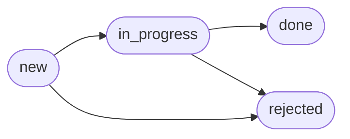

# CaseLabJS-case-2
REST API на Express: сервис учёта заявок на обслуживание оборудования.
<details>
<summary>
Инфомрация для проверяющего
</summary>

1. Несоответствие условию задания - несаснкционированные поля запроса должны игнориоваться, но у меня сервер ожидает строгий формат json по заданному шаблону.
2. Нет сортировки. Но есть пагинация **(нумерация с единицы!)** и фильтрация (параметры свойства, по котормоу выполняется фильтрация, передаются через запятую).
3. Таблица с эндпоинтами сгенерирована Gemini.
4. Схема перехода статусов сгенерирована Gemini.
5. Таблицы с полями моделей данных сгенерированы Gemini.
6. Раздел с примерами запросов и ответов полностью составлен Gemini на основе файла с тестами Postman (в каталоге doc).
7. Раздел "Безопасность и ограничения" сгенерирован Gemini.
8. Несоответствие условию задания - я не сразу догодался, что свойство plannedAt сущности заявки - это запланированная дата и время проведения работ. Поэтому в логике сервиса это поле никак не используется. При запросе к open-meteo (`/api/equipment/:equipmentId/weather`) отправялется количество дней в query параметрах (**daysCount**) (я думал, что можно просто указать количество дней на работу).
9. Пагинация и фильтрация была сделана в конце работы над проектом. Поэтому результаты тестов (GET названия которых начинаетсяне с Pagination и Filtered) в Postman с пагинацией имеют поля page и limit (ответ сервера - объект, включающий эти поля), а другие реузультаты запросов get и др. не имеют этих полей.
10. Тестировал только режим dev, prod не тестил (даже не запускал, если честно)

</details>

### Требования к окружению
* Node.Js: 22.x
* npm: 10.x
* ОС: Windows 10/11

## Установка
1. Клонируйте репозиторий:
`
git clone https://github.com/OlegTerV/CaseLabJS-case-2
`
2. Перейдите в папку проекта:
`
cd <путь_к_папке...>/CaseLabJS-case-2
`
3. Установите зависимости:
`
npm install
`

## Настройка
1. Скопируйте файл с заглушками. Перейдите в каталог src:
`
cd src
`
, создайте файл .env на основе файла с заглушками
`
copy .env.example .env
`
2. В файле для перменных окружения (.env) уже будут заданы значения по умолчанию. Вы можете заменить их на свои. Описание переменных:

|Переменная|Тип|Описание|
|:---------|:-|:-------|
|PORT|int|порт, на котором работает API|
|ALLOWED_ORIGIN|string|список разрешенных источников для CORS **через запятую без пробелов**|
|TIMEOUT|int|время ожидания ответа на запрос **в миллисекундах**|
|NODE_ENV|string|режим разработки: dev, prod|
|TEMPERATURE_2M_MAX|float|максимальный порог температуры, при которой комфортно проводить внешние работы **по Цельсю**|
|TEMPERATURE_2M_MIN|float|минимальный порог температуры, при которой комфортно проводить внешние работы **по Цельсю**|
|PRECIPITATION_SUM|float|максимальное количество осадков, при котором комфортно проводить внешние работы **в миллиметрах**|
|WIND_SPEED_10M_MAX|float|максимальная скорость ветра, при которой комфортно проводить внешние работы **в км/ч**|
|WEATHER_URL|string|адрес внешнего API для запроса прогноза погоды (сервис захордкожен для работы с [open-meteo](https://github.com/open-meteo/open-meteo) API)|
|RATE_LIMIT_WINDOW|int|временное окно **в миллисекундах**|
|RATE_LIMIT_MAX|int|количество запросов, которое может сделать клиент в рамках временного окна|
|API_VERSION|int|версия API|

## Запуск
После настройки перменных окружения вернитесь в корневой каталог (CaseLabJS-case-2):
```cmd
cd ..
```
Команда запуска:
```cmd
npm run start:dev
```
или
```cmd
nodemon --exec tsx src/server.ts
```
***prod не тестил***

## Список эндпоинтов
| Метод | Эндпоинт | Описание |
| :--- | :--- | :--- |
| **GET** | `/api/health` | Проверка доступности сервиса |
| **GET** | `/api/equipment` | Список оборудования: фильтры, пагинация |
| **POST** | `/api/equipment` | Создание единицы оборудования |
| **GET** | `/api/equipment/:equipmentId` | Карточка оборудования |
| **PATCH** | `/api/equipment/:equipmentId` | Частичное обновление |
| **DELETE** | `/api/equipment/:equipmentId` | Удаление (запрещено при наличии открытых заявок) |
| **GET** | `/api/equipment/:equipmentId/requests` | Заявки по конкретной единице оборудования |
| **GET** | `/api/equipment/:equipmentId/weather` | Прогноз по координатам объекта и пригодность окна для наружных работ |
| **GET** | `/api/requests` | Список заявок: фильтры, пагинация |
| **POST** | `/api/requests` | Создание заявки |
| **GET** | `/api/requests/:requestId` | Карточка заявки |
| **PATCH** | `/api/requests/:requestId` | Редактирование полей заявки |
| **PATCH** | `/api/requests/:requestId/status` | Смена статуса заявки с проверкой допустимости перехода |
| **DELETE** | `/api/requests/:requestId` | Удаление заявки |

## Схема перехода статусов


## Модели данных
#### 1. Оборудование (Equipment)
| Поле | Тип данных | Обязательное | Описание / Ограничения |
| :--- | :--- | :---: | :--- |
| `id` | `string (UUID)` | - | Генерируется сервером автоматически. |
| `name` | `string` | Да | От 3 до 100 символов. |
| `type` | `string` | Да | Допустимые значения: `turbine`, `inverter`, `sensor`, `substation`. |
| `serialNumber` | `string` | Да | Уникальный номер в пределах всей системы. |
| `location` | `object` | Да | Географические координаты устройства. Структура: `{ lat: number, lon: number }`. |
| `status` | `string` | Да | Допустимые значения: `operational`, `maintenance`, `fault`, `decommissioned`. |
| `installedAt` | `string (ISO-8601)` | Да | Дата установки. Не может быть в будущем. |

#### 2. Заявка на обслуживание (Maintenance Request)
| Поле | Тип данных | Обязательное | Описание / Ограничения |
| :--- | :--- | :---: | :--- |
| `id` | `string (UUID)` | - | Генерируется сервером автоматически. |
| `equipmentId` | `string (UUID)` | Да | Идентификатор оборудования. Ссылка на существующее устройство. |
| `title` | `string` | Да | От 5 до 120 символов. |
| `description` | `string` | Нет | Описание проблемы или работ. До 2000 символов. |
| `priority` | `string` | Да | Допустимые значения: `low`, `medium`, `high`, `critical`. |
| `status` | `string` | Да | Значение по умолчанию: `new`. Допустимые варианты: `new`, `in_progress`, `done`, `rejected`. |
| `plannedAt` | `string (ISO-8601)`| Нет | Запланированная дата и время проведения работ. |
| `createdAt` | `string (ISO-8601)`| - | Дата и время создания заявки. Проставляется сервером. |
| `updatedAt` | `string (ISO-8601)`| - | Дата и время последнего обновления. Проставляется сервером. |

## Безопасность и ограничения
* **CORS**: Разрешены HTTP-запросы всех типов (`GET`, `POST`, `PUT`, `DELETE`, `PATCH`). Список разрешенных адресов (origins) динамически загружается из переменной окружения `ALLOWED_ORIGIN`.
* **Rate Limiting**: Ограничение частоты запросов настраивается через переменные окружения. Максимальное количество запросов определяется параметром `RATE_LIMIT_MAX` в рамках временного окна `RATE_LIMIT_WINDOW`. При превышении лимита сервер возвращает ошибку `429 Too Many Requests`.


## Структура проекта
Стандартная слоиста архитектура Express API:
1. routes
2. controllers
3. services
4. repositories
5. errors - кастомные ошибки
6. storage - в рамках процесса обычные массивы с дефолтными данными
7. middlewares
8. models
9. docs - результаты тестирования в Postman


## Примеры работы
**Все примеры запросов и ответов представлены в разделе docs. В настоящем разделе только часть тестов.**
В качестве базового URL используется: `http://localhost:5000/api/v1`

### 1. Запрос списка элементов с одновременным использованием параметров фильтрации (`type`, `status`) и пагинации (`page`, `limit`).
#### Пример GET-запроса
```http
http://localhost:5000/api/v1/equipment?type=turbine,sensor&status=maintenance,operational&page=1&limit=2
```

#### Успешный ответ (`200 OK`)
```json
{
    "equipments": [
        {
            "id": "1b22e7a9-2d91-4a9a-ba1a-b4911737a318",
            "name": "Вентилятор",
            "type": "turbine",
            "serialNumber": "ASD-123",
            "location": {
                "lat": 12,
                "lon": 32
            },
            "status": "operational",
            "installedAt": "2026-09-10T15:30:00.000Z"
        },
        {
            "id": "1b22e7a9-2d91-4a9a-ba1a-b4911737a312",
            "name": "Вентилятор",
            "type": "turbine",
            "serialNumber": "EEE-123",
            "location": {
                "lat": 12,
                "lon": 32
            },
            "status": "operational",
            "installedAt": "2026-09-10T15:30:00.000Z"
        }
    ],
    "page": 1,
    "limit": 2
}
```

#### Ошибка валидации параметров (`400 Bad Request`)
Возникает, если передан неподдерживаемый query-параметр или некорректное значение:
```json
{
    "type": "https://my-future-doc/problems/invalid input",
    "title": "Некорректное значение query-параметра (status): operatonal",
    "instance": "/api/v1/equipment?type=turbine,sensor&status=maintenance,operatonal&page=1&limit=2",
    "requestId": "884b3935-0540-4656-82df-a56dcdc6fec4",
    "message": "Некорректное значение query-параметра (status): operatonal"
}
```

### 2. Получение списка заявок на обслуживание (Maintenance Requests)

Запрос списка всех заявок с одновременной фильтрацией по статусу/приоритету и пагинацией.

#### Пример GET-запроса
```http
http://localhost:5000/api/v1/requests?status=new,in_progress&priority=high,medium&page=1&limit=15
```

#### Успешный ответ (`200 OK`)
```json
{
    "maintenanceRequests": [
        {
            "id": "2af219d7-4c9b-4128-a20c-1c3c49c7a628",
            "equipmentId": "1b22e7a9-2d91-4a9a-ba1a-b4911737a318",
            "title": "Починить лопасти",
            "description": "Старые лопасти отслужили свой срок",
            "priority": "medium",
            "status": "new",
            "createdAt": "2026-09-10T15:30:00.000Z",
            "updatedAt": "2026-09-19T15:30:00.000Z"
        },
        {
            "id": "2af219d7-4c9b-4128-a20c-1c3c49c7a624",
            "equipmentId": "1b22e7a9-2d91-4a9a-ba1a-b4911737a318",
            "title": "Заменить специальные огни-лампочки",
            "description": "Старые огни прогорели",
            "priority": "high",
            "status": "in_progress",
            "createdAt": "2026-09-10T15:30:00.000Z",
            "updatedAt": "2026-09-19T15:30:00.000Z"
        },
        {
            "id": "2af219d7-4c9b-4128-a20c-1c3c49c7a623",
            "equipmentId": "1b22e7a9-2d91-4a9a-ba1a-b4911737a318",
            "title": "Починить трансформатор",
            "description": "Скачок напряжения",
            "priority": "high",
            "status": "in_progress",
            "createdAt": "2026-09-10T15:30:00.000Z",
            "updatedAt": "2026-09-19T15:30:00.000Z"
        }
    ],
    "page": 1,
    "limit": 15
}
```

#### Ошибка пагинации (`400 Bad Request`)
Возникает, если запрашиваемый номер страницы (`page`) превышает максимально доступный для текущего лимита:
```json
{
  "type": "https://my-future-doc/problems/invalid input",
  "title": "Для limit = 2 доступно максимум 2 страниц",
  "instance": "/api/v1/requests?status=new,%20in_progress&priority=high,%20medium&page=3&limit=2",
  "requestId": "1d88c03c-af90-4c4e-8a9c-919104e900d4",
  "message": "Для limit = 2 доступно максимум 2 страниц"
}
```

### 3. Создание нового оборудования (Create Equipment)

#### Пример POST-запроса
```http
http://localhost:5000/api/v1/equipment/

{
  "name": "Трансформатор-1",
  "type": "turbine",
  "serialNumber": "QQQ-111",
  "location": {
    "lat": 21,
    "lon": 11
  },
  "status": "maintenance",
  "installedAt": "2026-10-01T20:45:05.761Z"
}
```

#### Успешный ответ (`201 Created`)
```json
{
  "id": "c16dec66-671e-4890-b4f0-afbbdd4ce402",
  "name": "Трансформатор-1",
  "type": "turbine",
  "serialNumber": "QQQ-111",
  "location": {
    "lat": 21,
    "lon": 11
  },
  "status": "maintenance",
  "installedAt": "2026-10-01T20:45:05.761Z"
}
```

#### Ошибка конфликта данных (`409 Conflict`)
Возникает, если оборудование с указанным серийным номером уже зарегистрировано в системе:
```json
{
  "type": "https://my-future-doc/problems/conflict",
  "title": "Оборудование с сериныйм номером QQQ-111 уже существует!",
  "instance": "/api/equipment/",
  "requestId": "39e7890f-8aaf-450d-920d-ddb71ef5911f",
  "message": "Оборудование с сериныйм номером QQQ-111 уже существует!"
}
```

### 4. Обновление статуса заявки на обслуживание (Update Request Status)

#### Пример PATCH-запроса
```http
http://localhost:5000/api/v1/requests/2af219d7-4c9b-4128-a20c-1c3c49c7a628/status

{
  "status": "in_progress"
}
```

#### Успешный ответ (`200 OK`)
```json
{
  "id": "2af219d7-4c9b-4128-a20c-1c3c49c7a628",
  "equipmentId": "1b22e7a9-2d91-4a9a-ba1a-b4911737a318",
  "title": "Починить лопасти",
  "description": "Старые лопасти отслужили свой срок",
  "priority": "medium",
  "status": "in_progress",
  "createdAt": "2026-09-10T15:30:00.000Z",
  "updatedAt": "2026-10-03T17:21:47.405Z"
}
```

#### Ошибка бизнес-логики перехода статусов (`409 Conflict`)
Возникает при попытке перевести заявку в статус, нарушающий правила жизненного цикла (например, из `in_progress` обратно в `new`):
```json
{
  "type": "https://my-future-doc/problems/conflict",
  "title": "Нельзя изменить статус заявки с in_progress на new",
  "instance": "/api/v1/requests/2af219d7-4c9b-4128-a20c-1c3c49c7a628/status",
  "requestId": "19359b4e-ed7a-4f10-9872-339fb528d92c",
  "message": "Нельзя изменить статус заявки с in_progress на new"
}
```

### 5. Удаление оборудования (Delete Equipment)

#### Пример DELETE-запроса
```http
http://localhost:5000/api/v1/equipment/1b22e7a9-2d91-4a9a-ba1a-b4911737a314
```

#### Успешный ответ (`204 No Content`)
*Тело ответа пустое.*

#### Ошибка удаления связанного объекта (`409 Conflict`)
Возникает, если объект нельзя удалить из-за активных или незакрытых заявок на обслуживание:
```json
{
  "type": "https://my-future-doc/problems/conflict",
  "title": "Оборудование с id = 1b22e7a9-2d91-4a9a-ba1a-b4911737a318 имеет незакрытые заявки, его удалить нельзя",
  "instance": "/api/equipment/1b22e7a9-2d91-4a9a-ba1a-b4911737a318",
  "requestId": "9e117759-9d34-45b1-8167-84cd0d296e35",
  "message": "Оборудование с id = 1b22e7a9-2d91-4a9a-ba1a-b4911737a318 имеет незакрытые заявки, его удалить нельзя"
}
```

*Возможны ситуации падения сервиса, так как я мог что-то не обработать*